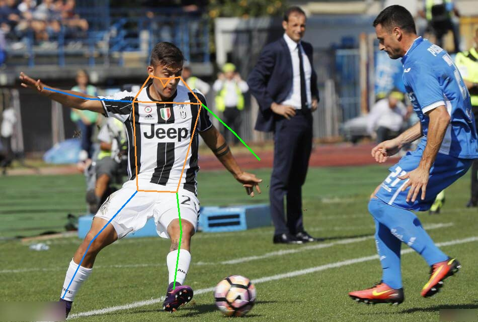

# RTMPose_TensorRT推理

## 1.配置环境

假设rtmpose虚拟环境已经适配yolov5的TensorRT推理

```python
conda activate rtmpose
cd ./RTMPose/export_engine/rtmlib-main/
pip install -r requirements.txt
```

## 2.转engine

```python
conda activate rtmpose
cd ./RTMPose/export_engine/rtmlib-main/
python export.py
```

### 3.TensorRT推理测试

修改RTMPose_TRT.py里面的输入输出及其engine路径

之后运行测试python RTMPose_TRT.py即可得到推理出的结果
<div align="center">   </div>
